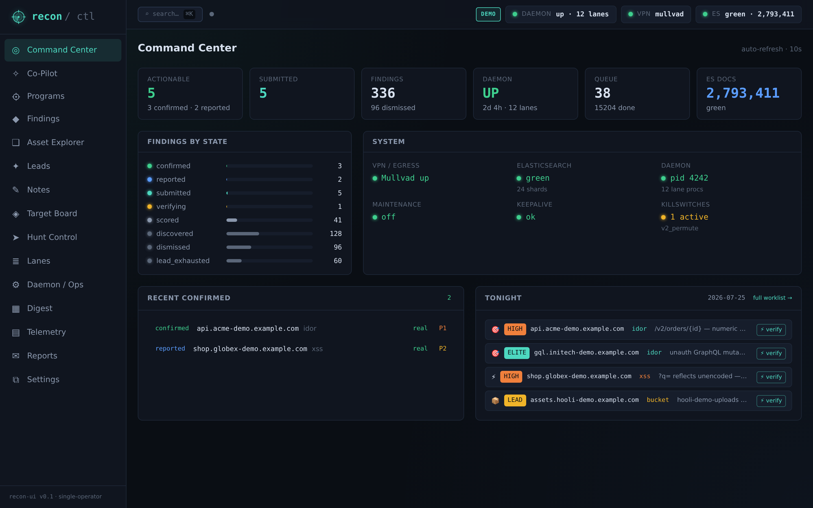
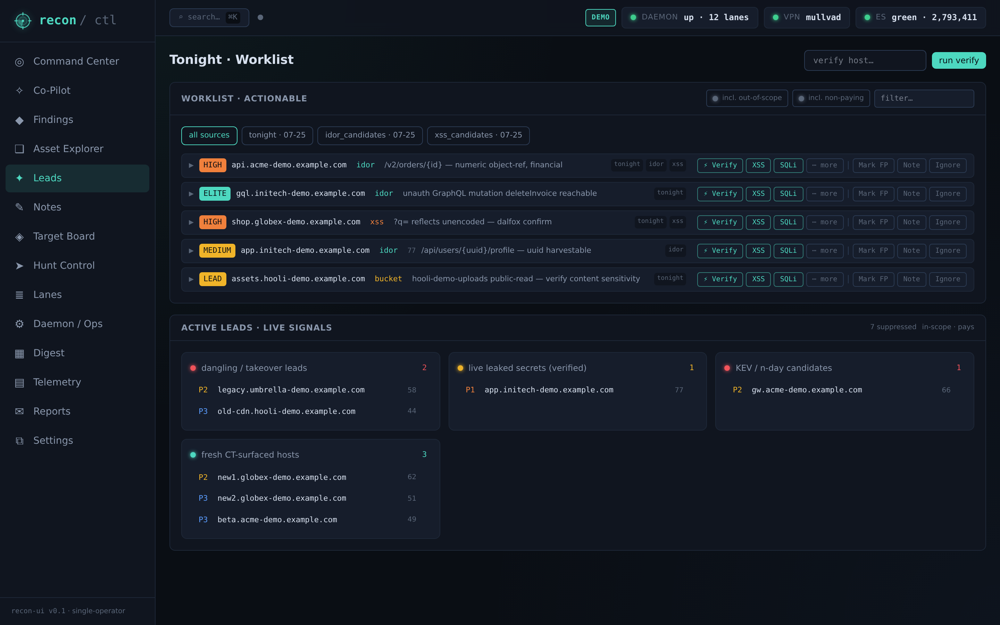
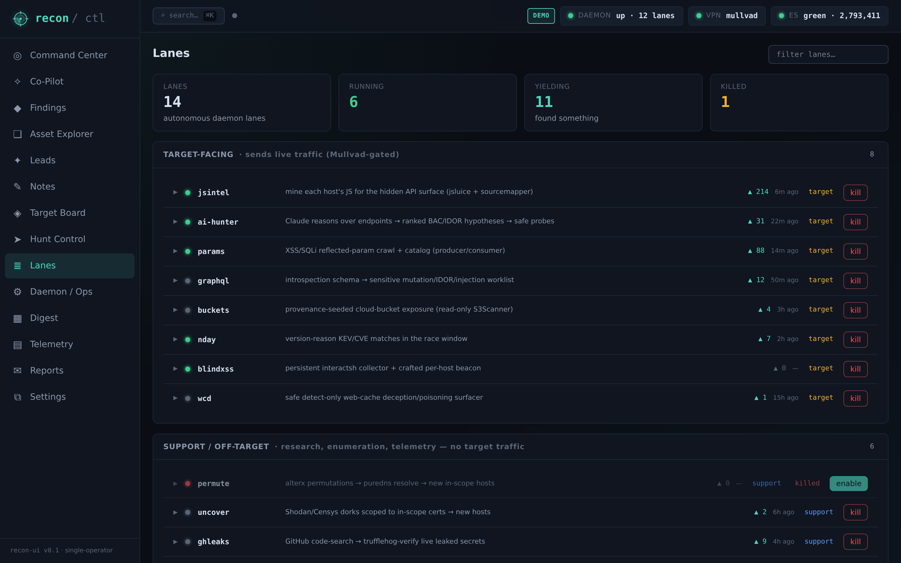
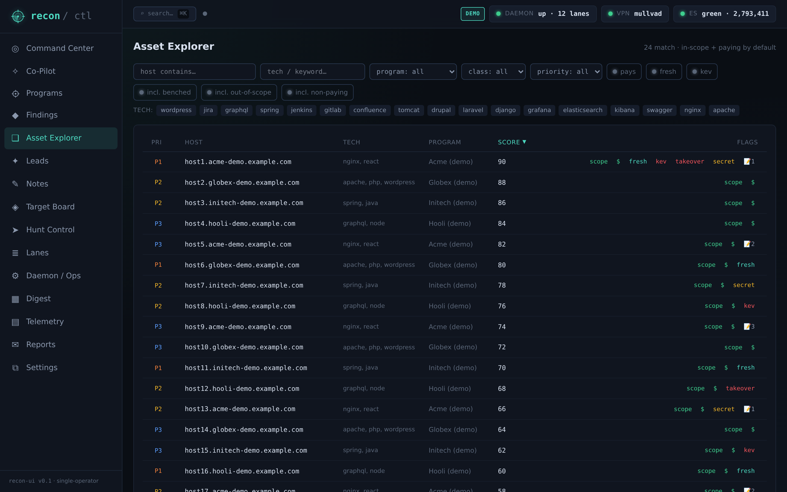
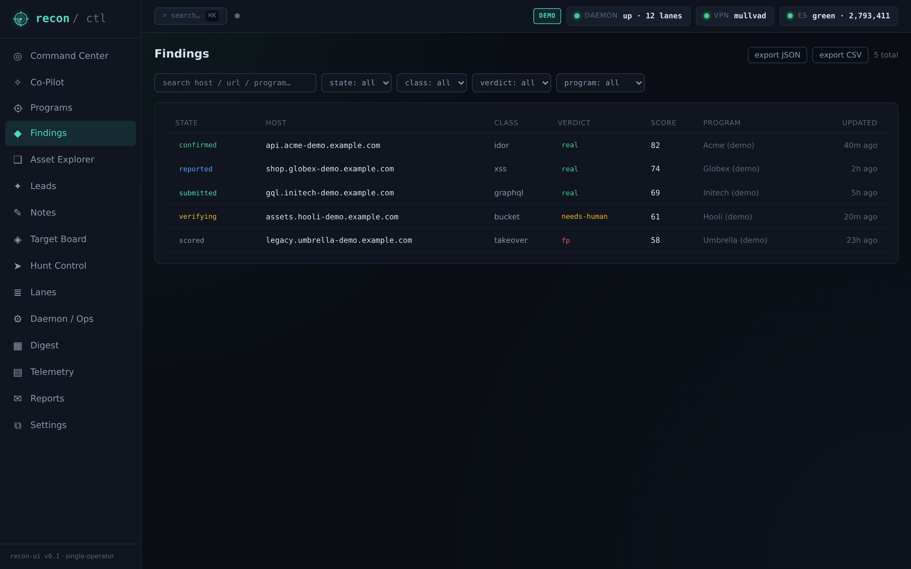
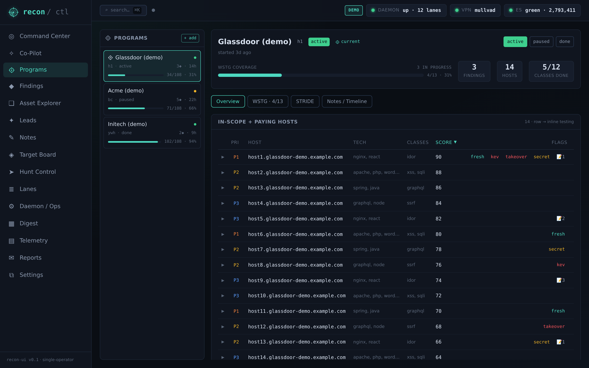

<div align="center">


# recon · ctl

**An AI-driven, dedup-first bug-bounty recon & triage pipeline with a web control plane.**

*It casts a wide net, lets Claude decide what's worth testing, gathers safe non-destructive
evidence, adversarially verifies every finding, and hands you a vetted, in-scope, human-decidable
queue — it never submits anything itself.*

</div>

---

> **Detection ≠ exploitation.** Pattern-match = LEAD; an observed safe primitive = CONFIRMED;
> only Claude-verified `real` findings reach you. See [`CLAUDE.md`](CLAUDE.md) for the full doctrine.

## What it is

Most recon pipelines run `subfinder | httpx | nuclei-defaults` on saturated programs — and find
what everyone finds. This one is built around a different bet: **go where the crowd doesn't, use an
LLM's *understanding* where commodity tools are blind, validate with a real PoC, and be first to
fresh surface.** Every lane has to answer "how is this not what everyone runs?"

Under the hood it discovers assets, scores them deterministically, has **Claude** triage the
in-scope + paying surface, confirms exposures with one precise **safe (unauthenticated,
non-destructive)** primitive per class, has Claude adversarially verify each confirmed finding
against a consensus panel, and batches the survivors into a nightly worklist and a token-gated web
C2. IDOR / BAC / RCE stay **operator-leads** — surfaced and ranked, never auto-exploited.

## Features — the UNIQUE pillars

| Lane | Edge |
|---|---|
| **JS-intel** | Mines each host's JS for the *hidden* API surface (jsluice AST + sourcemap reconstruction + verified-live-secret detection) — endpoints regex misses. |
| **AI IDOR/BAC hunter** | Claude reasons over the endpoint surface → app-model → ranked, dup-aware BAC/IDOR hypotheses → safe-probes the unauth-safe ones → mints CONFIRMED or a 2-account operator plan. The money class, human-confirmed. |
| **XSS / SQLi lane** | ~18k XSS / ~3k SQLi in-scope+paying URLs ranked by param injectability + freshness, split into rare per-app lanes vs product-class dup-magnets; confirm = dalfox *execution* / `'`-vs-`''` differential + sqlmap PoC-depth. |
| **n-day racing** | Version-reasons KEV/CVE matches to kill the tech-class FP and surface only genuine in-range candidates, in the race window. |
| **GraphQL** | Harvests the introspection schema and reasons over it (sensitive unauth mutations, object-ref IDOR args, injectable args) — Clairvoyance-style field recovery when introspection is off. |
| **Cloud buckets** | Provenance-seeded (never blind-permute), read-only ACL/list grading; public-write → confirmed, public-read → lead. |
| **Blind / stored-XSS** | Persistent interactsh + XSS-Hunter dual-beacon collection — a fire days later inside an admin console = dup-resistant, high-payout. |
| **Autoswagger** | Unauth Swagger/OpenAPI broken-authz scanning with PII/secret response-screening (GET-only, never `-risk`). |
| **Web control plane** | A React PWA + FastAPI backend: dashboard, leads, lanes, assets, findings — with an in-UI Claude co-pilot. |
| **Self-audit** | ~25 invariant checks on a schedule (VPN/egress, scope freshness, ES health, per-lane silent-zero, perm drift) → dated report + fix-prompts. |

Plus permutation-DNS, API-route brute (kiterunner), surface expansion (uncover/Shodan/Censys),
web-cache deception, active param discovery (arjun), and GitHub-leak hunting. Full doctrine and the
"be UNIQUE, or get duplicated" motto live in [`CLAUDE.md`](CLAUDE.md).

## Screenshots

> Live UI in demo mode (synthetic data). Regenerate with `python tools/capture_screenshots.py`.

| Dashboard | Leads | Lanes |
|---|---|---|
|  |  |  |

| Assets | Findings |
|---|---|
|  |  |  |

## Prerequisites

- **OS:** Kali (or Debian/Ubuntu) on **WSL2** is the developed-and-tested target; native Linux mostly works.
- **Go** (for the ProjectDiscovery / tomnomnom recon binaries), **Node ≥18 + npm** (web UI),
  **Python 3** (engine + workers), **Docker** (Elasticsearch 8.17.4 + Kibana, loopback-only).
- **Mullvad VPN** configured on the host as the **sole egress** (fail-closed — see Security model).
- **Claude Max subscription** logged in on the box (headless `claude -p`, no API key), **and**
  enrollment in **Anthropic's Cyber Verification Program (CVP)** for full offensive-security capability
  (see [AI engine](#ai-engine)).
- ~35 recon binaries (`subfinder`, `httpx`, `katana`, `nuclei`, `dalfox`, `gau`, `sqlmap`,
  `trufflehog`, `interactsh-client`, …) — **`install.sh` installs the go-based set and notes the rest.**

## Quickstart

```bash
git clone https://github.com/eldoktor1/recon-ctl.git ~/recon-ctl && cd ~/recon-ctl

# 1. Bootstrap (idempotent — safe to re-run; installs go tools, Autoswagger,
#    Playwright, the UI, and creates ~/recon runtime dirs)
./install.sh

# 2. Configure secrets + Elasticsearch (the installer's NEXT STEPS epilogue lists these):
cp docker/.env.example docker/.env && $EDITOR docker/.env
docker compose -f docker/docker-compose.yml up -d
bash scripts/recon_es_bootstrap.sh
#    ...plus ~/.recon_es_netrc and (optional) Discord/API-key files — chmod 600 them.

# 3. Claude — log in, and enroll in CVP for full capability:
claude          # then /login

# 4. Go live:
./tools/start_ui.sh    # web control plane at http://127.0.0.1:8787 (token-gated)
recon-start            # the daemon: preflight + VPN gate, then the loops
```

See [`docs/QUICKSTART.md`](docs/QUICKSTART.md) for a step-by-step first-run walkthrough.

## Architecture (v3.2)

```
DETECTION (cast a wide net)        →  triage (deterministic score; detection-only P0 → P0-CANDIDATE)
 discovery · validate · scope · true-fresh · cve-kev/nvd · vuln-feed ·
 js-scanner · params(4-wide) · portscan · bypass · takeover · cloudrecon
        │
CLAUDE ANALYZE (Haiku)             →  reads in-scope+paying assets, decides worth / vuln-class
        │
CONFIRM (SAFE, unauth, non-destructive)
   evidence-gate (nuclei): version · unauth-surface · content-leak · graphql · swagger ;
                           SSRF/XXE via interactsh OOB
   xss-confirm:   headless-Chromium marker EXECUTION
   param-confirm: SSTI ({{a*b}}→prod) · open-redirect (→canary) · SQLi (error-diff)
        │  every confirmation → SQLite findings.db
CLAUDE VERIFY (Sonnet → Opus on hard calls)  →  adversarial FP filter: real / fp / needs-human
        │
REPORTER (real only; dup + freshness gates; NEVER auto-submits) → review queue + #review
```

IDOR / LFI / RCE stay **operator-leads** (hard line — never auto-exploited). Deep detail:
[`engine/README.md`](engine/README.md).

## AI engine

The pipeline's autonomous **analysis, verification, and hunting run on Claude** (Max plan, headless
`claude -p`, no API key). Two layers aim and filter: **ANALYZE** (Haiku, bulk) aims the net;
**VERIFY** (Sonnet → Opus on ambiguity) kills false positives against a consensus panel. Nothing
reaches a report without Claude's `real` verdict.

> ### ⚠️ Cyber Verification Program (required for full capability)
> This pipeline performs authorized offensive-security work (vulnerability discovery, exploitation
> reasoning, PoC construction). By default, Claude's safeguards impede that dual-use work. To operate
> at **full capability** on cyber tasks, Claude must be enrolled in **Anthropic's Cyber Verification
> Program (CVP)** — a free, application-based program that verifies legitimate security organizations
> and unblocks penetration testing, exploitation reasoning, and vulnerability research. It is
> *verification, not exemption*: genuinely malicious categories (ransomware, mass data exfiltration)
> stay blocked for everyone. **Without CVP, capability on offensive tasks is limited.**
>
> Apply / manage: **https://portal.anthropic.com/programs/cvp** ·
> Background: [Making frontier cybersecurity capabilities available to defenders](https://www.anthropic.com/news/claude-code-security).

Claude is the default and only **turnkey** provider. The provider layer is pluggable — you can bring
another model — but each vendor needs its own cyber-verification / authorized-use program to run at
full capability. See [`docs/knowledge/ai-providers.md`](docs/knowledge/ai-providers.md).

## Responsible use / legal

**This is offensive-security tooling. Use it only against assets you are explicitly authorized to
test** — bug-bounty programs whose scope and rules of engagement permit it, or systems you own. The
pipeline is engineered around that boundary: scope-gated (in-scope + paying, re-checked live),
recon-not-attack (confirm an exposure exists, never exploit past it), fail-closed on VPN egress, and
human-gated on submission. **You are solely responsible for operating within the law and within
program scope.** Unauthorized access to computer systems is a crime in most jurisdictions. The
authors provide this software with no warranty and accept no liability for misuse.

See [`SECURITY.md`](SECURITY.md) for the operational-security model and how to report a vulnerability
**in this tool**.

## Daily driver

```bash
recon-status                 # daemon, loops, ES, VPN, queue
recon-logs                   # live stream
recon-ai status              # Claude verdict breakdown (real / needs-human / fp / pending)
recon-fresh | recon-top      # true-fresh queue · top triage targets
```

## Docs & meta

- [`docs/CONFIGURATION.md`](docs/CONFIGURATION.md) — configure the AI model (Claude + local fallback agent), Burp/Brave MCP, Mullvad egress, ES + secrets, and lanes. The **Settings → AI models · wizard** does most of it in-UI.
- [`CLAUDE.md`](CLAUDE.md) — the operating doctrine (the motto, the lanes, the hard lines).
- [`docs/knowledge/`](docs/knowledge/) — 45+ reusable `class-*` / `tech-*` / `tool-*` KB docs.
- [`docs/QUICKSTART.md`](docs/QUICKSTART.md) · [`SECURITY.md`](SECURITY.md) ·
  [`CONTRIBUTING.md`](CONTRIBUTING.md) · [`CHANGELOG.md`](CHANGELOG.md) (current: v3.2.0).

## Models (match-to-task, all on Max, no API)

Haiku = bulk analysis · Sonnet = verification · Opus = ambiguous `needs-human` escalation.
Override via `CLAUDE_ANALYZE_MODEL` / `CLAUDE_MODEL` / `CLAUDE_ESCALATE_MODEL`.

## License

[MIT](LICENSE). Dual-use offensive-security tooling: use it **only** for authorized testing —
bug-bounty programs whose scope and rules permit it, or systems you own. The no-warranty /
responsible-use terms in [`LICENSE`](LICENSE) and [`SECURITY.md`](SECURITY.md) apply in full.
